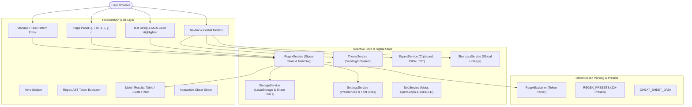

# ⚡ Regex Tester Pro — High-Performance Online Regular Expression Debugger

> **Production-grade, zero-latency, 100% client-side regular expression workbench built with Angular 22, TypeScript, Angular Signals, TailwindCSS, Monaco Editor, Angular SSR/SSG, and PWA support.**


---

## 🌟 Key Highlights & Philosophy

- **⚡ Blazing Fast**: Zero-latency compilation and matching using JavaScript's native optimized `RegExp` engine directly inside the browser.
- **🛡️ Strict Privacy**: 100% client-side. No user input or test string ever leaves the browser.
- **🎨 Developer Aesthetics**: High-end UI inspired by Vercel, Raycast, Linear, and Shadcn with seamless Dark, Light, and System theme switching.
- **🧩 Deterministic AST Explainer**: Client-side parser that translates regex tokens (anchors, character sets, quantifiers, lookaheads, lookbehinds) into human-readable explanations with zero AI overhead.
- **🎯 22+ Production Presets**: One-click patterns for Web URLs, RFC Emails, Passwords, UUIDs, Hex Colors, JWTs, IPv4/IPv6, and Indian Government/Financial formats (PAN, Aadhaar, GSTIN, Vehicle Plate, IFSC, UPI, PIN Code).
- **🔎 Multi-View Results**: Switch between **Table View** (with capture & named groups), **JSON View**, and **Raw View**.
- **🔄 Bidirectional Highlighting**: Hovering over a match in the text highlights its row in the results; hovering over a result card highlights the text span.
- **🚀 Angular SSR & Prerendering**: Pre-renders static routes (Home and Cheat Sheet) for maximum SEO.
- **📱 Progressive Web App (PWA)**: Works offline, installs natively on desktop and mobile.

---

## 🏗️ Architecture Diagram



---

## 📁 Clean Architecture Folder Structure

```
regex_tester/
├── .github/
│   └── workflows/
│       └── deploy.yml              # GitHub Pages CI/CD workflow
├── e2e/
│   └── regex-tester.spec.ts        # Playwright end-to-end test suite
├── public/
│   ├── favicon.ico                 # App favicon
│   ├── manifest.json               # Web App Manifest for PWA
│   ├── robots.txt                  # Search engine crawler instructions
│   ├── sitemap.xml                 # XML sitemap for SEO indexing
│   ├── sw.js                       # Service worker for offline caching
│   └── _headers                    # Cloudflare Pages security & caching headers
├── src/
│   ├── app/
│   │   ├── components/
│   │   │   ├── cheat-sheet-drawer/ # Interactive slide-out token drawer
│   │   │   ├── editor/             # Monaco & high-performance regex editor
│   │   │   ├── flags-panel/        # Flags toggle (g, i, m, s, u, y, d)
│   │   │   ├── footer/             # Rich developer footer with SEO links
│   │   │   ├── hero/               # Large hero with animated badges
│   │   │   ├── match-results/      # Table, JSON, and Raw match results
│   │   │   ├── navbar/             # Sticky header with actions and theme toggle
│   │   │   ├── preset-library/     # Searchable 22+ one-click presets modal
│   │   │   ├── regex-explainer/    # Visual AST token breakdown cards
│   │   │   ├── settings-modal/     # Font size, word wrap, and theme preferences
│   │   │   ├── share-modal/        # Shareable URL encoder & social sharing
│   │   │   ├── shortcuts-modal/    # Hotkeys cheat sheet modal
│   │   │   ├── test-string-editor/ # Live text editor with multi-color highlights
│   │   │   └── toast/              # Transient notification feedback
│   │   ├── models/
│   │   │   └── regex.models.ts     # TypeScript interfaces and types
│   │   ├── pages/
│   │   │   ├── cheat-sheet-page/   # Dedicated full-page cheat sheet
│   │   │   └── home/               # Main workbench layout with split panels
│   │   ├── services/
│   │   │   ├── export.service.ts   # Copying, downloading, and link sharing
│   │   │   ├── regex.service.ts    # Signal-based regex compilation & execution
│   │   │   ├── seo.service.ts      # Dynamic meta tags, OpenGraph & JSON-LD
│   │   │   ├── settings.service.ts # Preferences state & font management
│   │   │   ├── shortcuts.service.ts# Keyboard hotkeys listener
│   │   │   ├── storage.service.ts  # LocalStorage persistence & URL state
│   │   │   └── theme.service.ts    # Dark/Light/System theme provider
│   │   ├── utils/
│   │   │   ├── cheat-sheet-data.ts # Token cheat sheet catalog
│   │   │   ├── regex-explainer.ts  # Deterministic regex AST parser
│   │   │   └── regex-presets.ts    # 22+ curated production regex presets
│   │   ├── app.config.server.ts    # Angular SSR server configuration
│   │   ├── app.config.ts           # Client app providers & in-memory routing
│   │   ├── app.routes.server.ts    # Static route prerendering configurations
│   │   ├── app.routes.ts           # Standalone lazy-loaded routing definitions
│   │   ├── app.html                # App shell template
│   │   └── app.ts                  # Root standalone component
│   ├── index.html                  # HTML entry point with fonts & anti-flash
│   ├── main.server.ts              # Angular SSR server bootstrap
│   ├── main.ts                     # Angular browser bootstrap
│   ├── server.ts                   # Express SSR server
│   └── styles.css                  # TailwindCSS v4 and match color styles
├── angular.json                    # Angular CLI build & asset configurations
├── firebase.json                   # Firebase Hosting configuration
├── netlify.toml                    # Netlify deployment configuration
├── package.json                    # Dependencies & build scripts
├── playwright.config.ts            # Playwright E2E configuration
├── tsconfig.app.json               # TypeScript application config
└── tsconfig.json                   # TypeScript root configuration
```

---

## ⌨️ Keyboard Shortcuts

| Shortcut | Description |
| :--- | :--- |
| <kbd>Ctrl</kbd> + <kbd>/</kbd> (or <kbd>⌘</kbd> + <kbd>/</kbd>) | **Focus Pattern Editor** |
| <kbd>Ctrl</kbd> + <kbd>Shift</kbd> + <kbd>C</kbd> | **Copy Regex** as `/pattern/flags` |
| <kbd>Ctrl</kbd> + <kbd>Shift</kbd> + <kbd>R</kbd> | **Reset State** to default sample |
| <kbd>Ctrl</kbd> + <kbd>L</kbd> | **Clear Pattern & Test String** |
| <kbd>Esc</kbd> | **Close any active modal or drawer** |

---

## 🛠️ Installation & Local Development

### Prerequisites
- **Node.js**: v18.19+ (Node.js 20 or 22 recommended)
- **npm**: v9+ (or v11+)

### 1. Clone & Install
```bash
git clone https://github.com/prasun1060/regex_tester.git
cd regex_tester
npm install
```

### 2. Run Local Development Server
```bash
npm start
```
Navigate to `http://localhost:4200/` in your browser.

---

## 🧪 Testing

### 1. Vitest Unit & Component Tests
```bash
npm test -- --watch=false
```
Executes all unit tests for `RegexService`, `RegexExplainer`, and component smoke tests.

### 2. Playwright End-to-End (E2E) Tests
```bash
npm run test:e2e
```
Runs end-to-end user flows including regex evaluation, flag toggling, preset application, and cheat sheet navigation.

---

## 📦 Production Build & Prerendering

Generate a fully optimized production bundle with static routes prerendered:

```bash
npm run build
```

Output is emitted to:
- `dist/regex-tester/browser`: Static client-side files, prerendered HTML, assets, and service worker.
- `dist/regex-tester/server`: Node.js Express server bundle for SSR environments.

---

## 🚀 Deployment Guide

This project can be deployed to any major hosting provider with zero code changes:

### 1. GitHub Pages
A pre-configured GitHub Actions workflow is located at `.github/workflows/deploy.yml`. Simply push to `main` and enable GitHub Pages in your repository settings (Source: GitHub Actions).

### 2. Cloudflare Pages
- **Framework Preset**: None / Angular
- **Build command**: `npm run build`
- **Build output directory**: `dist/regex-tester/browser`
- Pre-configured `public/_headers` handles security and caching headers automatically.

### 3. Firebase Hosting
Configured in `firebase.json`:
```bash
npm install -g firebase-tools
firebase login
firebase deploy --only hosting
```

### 4. Netlify
Configured in `netlify.toml`:
Connect your repository to Netlify or deploy via Netlify CLI:
```bash
netlify deploy --prod --dir=dist/regex-tester/browser
```

---

## 📝 License

Distributed under the **MIT License**. Free for personal, commercial, and open-source use.
